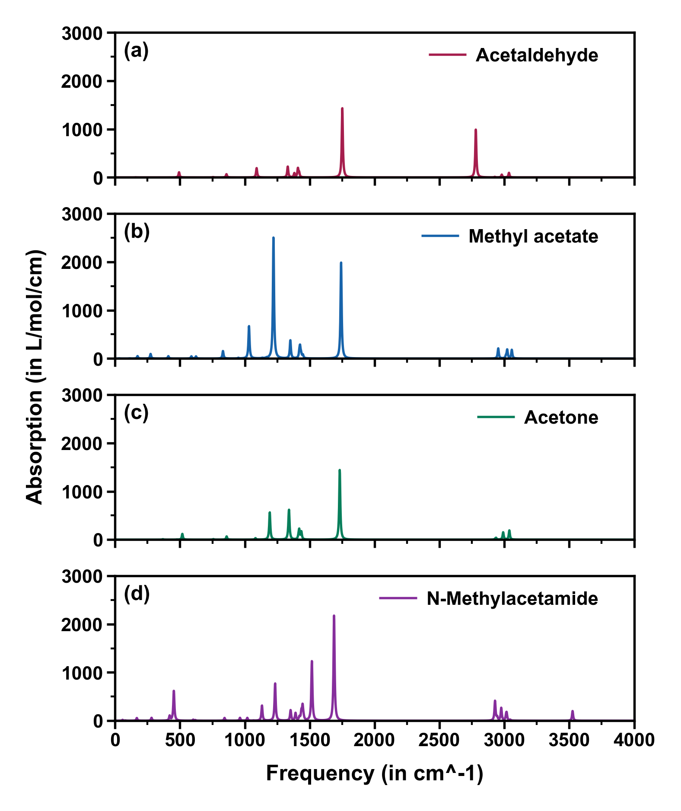

# pySubplots

pySubplots 是 Kimariyb 开发的一款绘制多子图图片的开源 Python 脚本。本脚本主要使用了 Python 第三方库， Matplotlib 以及 Proplot。

## 安装

**推荐！** 我们推荐使用 **_anaconda_** 虚拟环境进行安装，方便对包进行管理，同时也不会影响其他项目的环境。

如果没有安装 Python，可以不用安装 Python，直接前往 anaconda 官网下载 anaconda 最新版本。安装并配置好以后，使用 anaconda 新建一个环境。

```shell
conda create -n subplots python=3.8.13
```

激活名为 subplots 的 conda 环境：

```shell
conda activate subplots
```

使用 pip 工具安装 pySubplots

```shell
pip install pysubplots
```

同时需要安装 pySubplots 运行所依靠的包和模块

```shell
pip install pandas==1.4.3 -i https://pypi.tuna.tsinghua.edu.cn/simple
pip install numpy==1.23.5 -i https://pypi.tuna.tsinghua.edu.cn/simple
pip install proplot==0.9.5 -i https://pypi.tuna.tsinghua.edu.cn/simple
pip install matplotlib==3.4.3 -i https://pypi.tuna.tsinghua.edu.cn/simple
pip install toml==0.10.2 -i https://pypi.tuna.tsinghua.edu.cn/simple
pip install wxpython==4.2.1 -i https://pypi.tuna.tsinghua.edu.cn/simple
pip install openpyxl==3.1.2 -i https://pypi.tuna.tsinghua.edu.cn/simple
```

## 使用

**请注意：在正式运行前，请确保已经安装了 pySubplots 所需要的模块和包，以免程序报错！**

运行 pySubplots 需要准备一个 toml 文件以及 Multiwfn 或者其他程序生成的记载 x、y 数据的 txt 文件或者 xlsx 文件。

```toml
[[file]]
path = "CH3CHO.txt"
colors = "pink9"
styles = "-"
legend = "Acetaldehyde"
xlim = [0, 4000, 500]
ylim = [0, 3000, 1000]
xlabel = "Frequency (in cm^-1)"
ylabel = "Absorption (in L/mol/cm)"
iszero = 0
islegend = 1

[[file]]
path = "CH3CO2CH3.txt"
colors = "blue9"
styles = "-"
legend = "Methyl acetate"
xlim = [0, 4000, 500]
ylim = [0, 3000, 1000]
xlabel = "Frequency (in cm^-1)"
ylabel = "Absorption (in L/mol/cm)"
iszero = 0
islegend = 1

[[file]]
path = "CH3COCH3.txt"
colors = "teal9"
styles = "-"
legend = "Acetone"
xlim = [0, 4000, 500]
ylim = [0, 3000, 1000]
xlabel = "Frequency (in cm^-1)"
ylabel = "Absorption (in L/mol/cm)"
iszero = 0
islegend = 1

[[file]]
path = "CH3CONHCH3.txt"
colors = "grape9"
styles = "-"
legend = "N-Methylacetamide"
xlim = [0, 4000, 500]
ylim = [0, 3000, 1000]
xlabel = "Frequency (in cm^-1)"
ylabel = "Absorption (in L/mol/cm)"
iszero = 0
islegend = 1
```

如果使用 pip 安装了 pySubplots，可以直接在终端中输入 subplots 命令运行 pySubplots

```shell
subplots
```

接着程序显示程序头以及提示你要你选择一个 toml 文件，所有的指令和提示非常清晰，比如输入 q 可以直接退出，按空格可以使用 GUI 选择 toml 文件。

```shell
pySubplots -- A python script for plotting multiple subplots.
Version: 1.2.0, release date: Sep-03-2023
Developer: Kimariyb, Ryan Hsiun
Address: XiaMen University, School of Electronic Science and Engineering
pySubplots home website: https://github.com/kimariyb/py-subplots

(Copyright (c) 2023 Kimariyb. Currently timeline: Sep-03-2023, 00:45:21)

Input toml file path, for example E:\Hello\World.toml
Hint: Press ENTER button directly can select file in a GUI window. If you want to exit the program, simply type the letter "q" and press Enter.
```

输入 toml 文件之后就可以进入主程序页面，接着可以输入命令，每一个命令的含义都在屏幕上显示的非常清楚。假如想直接看看默认的绘图效果，可以输入 0。当然大部分情况下，默认的设置都不太可能满足用户的需求，这时候可以输入其他命令修改绘图的设置。最后可以使用命令 1 保存图片。

```shell
 "q": Exit program gracefully	 "r": Load a new file
********************************************************
****************** Main function menu ******************
********************************************************
-4 Set figure layout of subplots, current: [2, 2]
-3 Showing the serial of subplots, current: True
-2 Set whether to share axis ticks , current: True
-1 Set whether to share axis labels, current: True
0 Save graphical file of the spectrum in current folder
1 Set font family of the spectrum, current: Arial
2 Set font size of the spectrum, current: [10.5, 12]
3 Set figure size of spectrum file, current: (10, 10)
4 Set format of saving spectrum file, current: png
5 Set dpi of saving spectrum, current: 400
```

**pySubplot 目前仅支持绘制单曲线的多子图！**

## 有关 toml 文件

toml 文件是一种记录 key-values 数据的用于存储数据的文件。pySubplots 的 toml 文件中必须存在一个 `[[file]]` 开头，这个 `[[file]]` 表示你在 toml 文件中配置了一个子图。在 `[[file]]` 中可以配置以下属性。

- `path`: `string`, Multiwfn 输出的 txt 文件路径
- `colors`: `string; list(string...)`, 绘制曲线颜色
- `styles`: `string; list(string...)`, 绘制曲线风格
- `legend`: `string`, 图例的文本
- `xlim`: `list(float, float, float)`, x 轴的最小值、最大值以及间距
- `ylim`: `list(float, float, float)`, y 轴的最小值、最大值以及间距
- `xlabel`: `string`, x 轴的标签
- `ylabel`: `string`, y 轴的标签
- `iszero`: `bool`, 是否开启 zero 轴; 0 False；1 True
- `islegend`: `bool`, 是否显示图例; 可以选择 0 False；1 True



## 许可证

pySubplots 基于 MIT 许可证开源。这意味着您可以自由地使用、修改和分发代码。


